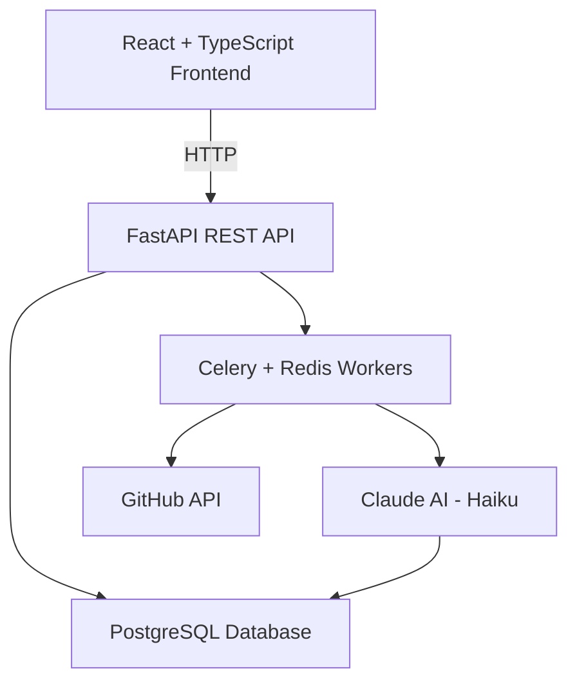

# RepoMind — AI Codebase Intelligence Platform

A full-stack developer tool that uses AI to analyze GitHub repositories, summarize every file, generate architecture overviews, and answer natural language questions about any codebase.

## Tech Stack

**Backend**
- FastAPI + Python 3.11
- PostgreSQL + SQLAlchemy + Alembic
- Redis + Celery (async analysis workers)
- Claude AI (Haiku) — file summarization, architecture analysis, codebase chat
- JWT authentication

**Frontend**
- React 18 + TypeScript
- Tailwind CSS v3
- React Query + React Router v6
- Axios

## Features

- **Repo ingestion** — Add any public GitHub repo by `owner/repo` slug
- **AI file summarization** — Claude analyzes every code file and generates a 2-3 sentence summary of its purpose and role in the codebase
- **Architecture overview** — Automatically generates tech stack, entry points, and an onboarding guide for new developers
- **Codebase chat** — Ask natural language questions and get answers grounded in actual file summaries
- **Background workers** — Celery + Redis handle long-running analysis jobs without blocking the API
- **Real-time status** — Dashboard polls and updates repo status from `pending → analyzing → ready`

## Architecture


## Getting Started

### Prerequisites
- Python 3.11+
- Node 18+
- PostgreSQL 16+
- Redis
- Anthropic API key

### Backend Setup
```bash
cd backend
python3 -m venv venv
source venv/bin/activate
pip install -r requirements.txt
cp .env.example .env
alembic upgrade head
uvicorn app.main:app --reload
```

### Celery Worker
```bash
cd backend
source venv/bin/activate
celery -A app.workers.celery_app worker --loglevel=info
```

### Frontend Setup
```bash
cd frontend
npm install
npm run dev
```

### Environment Variables
DATABASE_URL=postgresql://user@localhost:5432/repomind
REDIS_URL=redis://localhost:6379/0
SECRET_KEY=your-secret-key
ANTHROPIC_API_KEY=sk-ant-...
FRONTEND_URL=http://localhost:5173

## API Endpoints

| Method | Endpoint | Description |
|--------|----------|-------------|
| POST | `/api/v1/auth/register` | Register a new user |
| POST | `/api/v1/auth/login` | Login and get JWT |
| POST | `/api/v1/repos` | Add a GitHub repo |
| GET | `/api/v1/repos` | List user's repos |
| POST | `/api/v1/repos/{id}/analyze` | Trigger AI analysis |
| GET | `/api/v1/repos/{id}/analyses` | Get analysis results |
| GET | `/api/v1/repos/{id}/files` | Get file summaries |
| POST | `/api/v1/repos/{id}/chat` | Chat with the codebase |

## Key Technical Decisions

- **Async analysis pipeline** — Celery workers decouple repo analysis from the HTTP request cycle, enabling analysis of 50+ files without timeouts
- **Chunked file processing** — Files over 100kb are skipped; content truncated to 3,000 chars per Claude call to stay within token limits
- **Structured AI output** — Architecture analysis prompts Claude to return strict JSON, stripped of markdown fences before parsing
- **JWT auth** — Stateless authentication with per-user repo isolation enforced at the database query level
- **GitHub redirect handling** — httpx client configured with `follow_redirects=True` to handle renamed or transferred repositories

## Resume Metrics This Project Demonstrates

- Built async AI pipeline using Celery + Redis that processes 50 files per repo with individual Claude summarization calls
- Designed cost-efficient AI architecture using Claude Haiku for file summarization and context-aware codebase chat
- Implemented GitHub API integration with redirect handling, binary file filtering, and 100kb size limits
- Full-stack TypeScript + FastAPI application with JWT auth, React Query polling, and real-time status updates
